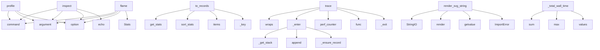

# System Architecture Analysis

## Overview

- **Project**: /home/tom/github/semcod/metrun
- **Primary Language**: python
- **Languages**: python: 10, shell: 1
- **Analysis Mode**: static
- **Total Functions**: 47
- **Total Classes**: 8
- **Modules**: 11
- **Entry Points**: 33

## Architecture by Module

### metrun.profiler
- **Functions**: 12
- **Classes**: 2
- **File**: `profiler.py`

### metrun.cprofile_bridge
- **Functions**: 9
- **Classes**: 1
- **File**: `cprofile_bridge.py`

### metrun.cli
- **Functions**: 6
- **File**: `cli.py`

### metrun.bottleneck
- **Functions**: 6
- **Classes**: 2
- **File**: `bottleneck.py`

### metrun.flamegraph
- **Functions**: 4
- **File**: `flamegraph.py`

### metrun.suggestions
- **Functions**: 3
- **Classes**: 1
- **File**: `suggestions.py`

### metrun.critical_path
- **Functions**: 3
- **Classes**: 2
- **File**: `critical_path.py`

### demo
- **Functions**: 2
- **File**: `demo.py`

### metrun.report
- **Functions**: 2
- **File**: `report.py`

## Key Entry Points

Main execution flows into the system:

### metrun.cli.profile
> Profile SCRIPT and display the bottleneck report.

SCRIPT is the path to a Python file to profile.
- **Calls**: cli.command, click.argument, click.option, click.option, click.option, click.echo, metrun.cli._run_script, bridge.to_records

### metrun.cli.inspect
> Enhanced profile of SCRIPT: bottlenecks + critical path + suggestions.

SCRIPT is the path to a Python file to profile.
- **Calls**: cli.command, click.argument, click.option, click.option, click.echo, metrun.cli._run_script, bridge.to_records, metrun.bottleneck.BottleneckEngine.analyse

### metrun.cprofile_bridge.CProfileBridge.to_records
> Convert cProfile stats to a ``dict[name, FunctionRecord]``.

The conversion maps ``pstats`` entries as follows:

* ``name``        → ``"filename:linen
- **Calls**: self.get_stats, stats_obj.sort_stats, raw.items, raw.items, _key, _key, FunctionRecord, _key

### metrun.cli.flame
> Convert an existing .prof file to an SVG flamegraph.

PROF_FILE is the path to a cProfile .prof dump
(created with cProfile.dump_stats or ``metrun pro
- **Calls**: cli.command, click.argument, click.option, click.option, pstats.Stats, metrun.flamegraph.render_svg, click.echo, click.Path

### metrun.profiler.ExecutionTracer._enter
- **Calls**: self._get_stack, stack.append, self._ensure_record, self._ensure_record, parent.children.append, record.parents.append

### metrun.profiler.ExecutionTracer.trace
> Decorator: trace every call to *func*.
- **Calls**: functools.wraps, self._enter, time.perf_counter, func, self._exit, time.perf_counter

### metrun.flamegraph.render_svg_string
> Like :func:`render_svg` but return the SVG markup as a string instead of
writing to a file.

Useful for embedding flamegraphs in HTML reports or Jupyt
- **Calls**: io.StringIO, flameprof.render, buf.getvalue, ImportError

### metrun.bottleneck.BottleneckEngine._total_wall_time
> Sum of all top-level (root) function times, or max if no roots exist.
- **Calls**: sum, max, self._records.values, self._records.values

### metrun.profiler.ExecutionTracer.section
> Context manager: trace a named code section.
- **Calls**: self._enter, time.perf_counter, self._exit, time.perf_counter

### metrun.profiler.ExecutionTracer._exit
- **Calls**: self._get_stack, stack.pop, self._ensure_record

### metrun.suggestions.print_suggestions
> Print suggestions for a single function to stdout.
- **Calls**: print, metrun.suggestions.format_suggestions

### metrun.bottleneck.BottleneckEngine._compute_score
- **Calls**: math.log10, round

### metrun.bottleneck.analyse
> Convenience function: run the engine and return ranked bottlenecks.
- **Calls**: None.analyse, BottleneckEngine

### metrun.profiler.ExecutionTracer.__init__
- **Calls**: threading.Lock, threading.local

### metrun.profiler.trace
> Decorator using the default (or supplied) tracer.

Can be used with or without parentheses:
    @trace
    def foo(): ...

    @trace(tracer=my_tracer
- **Calls**: _tracer.trace, _tracer.trace

### metrun.cprofile_bridge.CProfileBridge.profile_func
> Decorator: profile every call to *func* with cProfile.
- **Calls**: functools.wraps, self._profile.runcall

### metrun.cprofile_bridge.CProfileBridge.profile_block
> Context manager: profile the enclosed code block.
- **Calls**: self._profile.enable, self._profile.disable

### metrun.cprofile_bridge.CProfileBridge.get_stats
> Return a :class:`pstats.Stats` object for the accumulated profile.
- **Calls**: io.StringIO, pstats.Stats

### metrun.cli.main
- **Calls**: metrun.cli.cli

### demo.handler
- **Calls**: demo.slow_query

### metrun.profiler.ExecutionTracer._get_stack
- **Calls**: hasattr

### metrun.profiler.ExecutionTracer._ensure_record
- **Calls**: FunctionRecord

### metrun.profiler.ExecutionTracer.reset
- **Calls**: self._records.clear

### metrun.profiler.section
> Context manager using the default (or supplied) tracer.
- **Calls**: _tracer.section

### metrun.profiler.reset
> Reset all collected records in the default (or supplied) tracer.
- **Calls**: _tracer.reset

### metrun.cprofile_bridge.CProfileBridge.__init__
- **Calls**: cProfile.Profile

### metrun.cprofile_bridge.CProfileBridge.save
> Dump the accumulated profile to *path* (a ``*.prof`` file).

The resulting file can be opened with:

* ``snakeviz profile.prof``  — interactive web vi
- **Calls**: self._profile.dump_stats

### metrun.cprofile_bridge.CProfileBridge.reset
> Discard all accumulated profiling data.
- **Calls**: cProfile.Profile

### metrun.cprofile_bridge.CProfileBridge.__enter__
- **Calls**: self._profile.enable

### metrun.cprofile_bridge.CProfileBridge.__exit__
- **Calls**: self._profile.disable

## Process Flows

Key execution flows identified:

### Flow 1: profile
```
profile [metrun.cli]
```

### Flow 2: inspect
```
inspect [metrun.cli]
```

### Flow 3: to_records
```
to_records [metrun.cprofile_bridge.CProfileBridge]
```

### Flow 4: flame
```
flame [metrun.cli]
```

### Flow 5: _enter
```
_enter [metrun.profiler.ExecutionTracer]
```

### Flow 6: trace
```
trace [metrun.profiler.ExecutionTracer]
```

### Flow 7: render_svg_string
```
render_svg_string [metrun.flamegraph]
```

### Flow 8: _total_wall_time
```
_total_wall_time [metrun.bottleneck.BottleneckEngine]
```

### Flow 9: section
```
section [metrun.profiler.ExecutionTracer]
```

### Flow 10: _exit
```
_exit [metrun.profiler.ExecutionTracer]
```

## Key Classes

### metrun.profiler.ExecutionTracer
> Thread-local call-stack tracer.

Usage — decorator:
    tracer = ExecutionTracer()

    @tracer.trac
- **Methods**: 9
- **Key Methods**: metrun.profiler.ExecutionTracer.__init__, metrun.profiler.ExecutionTracer._get_stack, metrun.profiler.ExecutionTracer._ensure_record, metrun.profiler.ExecutionTracer._enter, metrun.profiler.ExecutionTracer._exit, metrun.profiler.ExecutionTracer.records, metrun.profiler.ExecutionTracer.reset, metrun.profiler.ExecutionTracer.trace, metrun.profiler.ExecutionTracer.section

### metrun.cprofile_bridge.CProfileBridge
> Thin wrapper around :class:`cProfile.Profile` that exposes profiling
results as metrun :class:`~metr
- **Methods**: 9
- **Key Methods**: metrun.cprofile_bridge.CProfileBridge.__init__, metrun.cprofile_bridge.CProfileBridge.profile_func, metrun.cprofile_bridge.CProfileBridge.profile_block, metrun.cprofile_bridge.CProfileBridge.get_stats, metrun.cprofile_bridge.CProfileBridge.to_records, metrun.cprofile_bridge.CProfileBridge.save, metrun.cprofile_bridge.CProfileBridge.reset, metrun.cprofile_bridge.CProfileBridge.__enter__, metrun.cprofile_bridge.CProfileBridge.__exit__

### metrun.bottleneck.BottleneckEngine
> Analyse a dict of FunctionRecords and return a ranked list of Bottlenecks.

Example::

    engine = 
- **Methods**: 5
- **Key Methods**: metrun.bottleneck.BottleneckEngine.__init__, metrun.bottleneck.BottleneckEngine._total_wall_time, metrun.bottleneck.BottleneckEngine._compute_score, metrun.bottleneck.BottleneckEngine._diagnose, metrun.bottleneck.BottleneckEngine.analyse

### metrun.critical_path.CriticalPath
> The result of a critical-path analysis.
- **Methods**: 1
- **Key Methods**: metrun.critical_path.CriticalPath.length

### metrun.profiler.FunctionRecord
> Aggregated stats for a single function (or call-site).
- **Methods**: 1
- **Key Methods**: metrun.profiler.FunctionRecord.avg_time

### metrun.suggestions.Suggestion
> A single actionable fix suggestion.
- **Methods**: 0

### metrun.critical_path.CriticalPathNode
> A single node in the critical path.
- **Methods**: 0

### metrun.bottleneck.Bottleneck
> A single bottleneck entry produced by the engine.
- **Methods**: 0

## Data Transformation Functions

Key functions that process and transform data:

### metrun.suggestions.format_suggestions
> Render suggestions for a single function as a human-readable string.

Parameters
----------
name:
  
- **Output to**: enumerate, None.join, lines.append, lines.append, lines.append

### metrun.critical_path.format_critical_path
> Render a :class:`CriticalPath` as a human-readable string.

Example output::

    🧨 Critical Path  (
- **Output to**: lines.append, lines.append, enumerate, None.join, lines.append

## Behavioral Patterns

### state_machine_ExecutionTracer
- **Type**: state_machine
- **Confidence**: 0.70
- **Functions**: metrun.profiler.ExecutionTracer.__init__, metrun.profiler.ExecutionTracer._get_stack, metrun.profiler.ExecutionTracer._ensure_record, metrun.profiler.ExecutionTracer._enter, metrun.profiler.ExecutionTracer._exit

### state_machine_CProfileBridge
- **Type**: state_machine
- **Confidence**: 0.70
- **Functions**: metrun.cprofile_bridge.CProfileBridge.__init__, metrun.cprofile_bridge.CProfileBridge.profile_func, metrun.cprofile_bridge.CProfileBridge.profile_block, metrun.cprofile_bridge.CProfileBridge.get_stats, metrun.cprofile_bridge.CProfileBridge.to_records

## Public API Surface

Functions exposed as public API (no underscore prefix):

- `metrun.report.generate_report` - 35 calls
- `metrun.cli.profile` - 16 calls
- `metrun.cli.inspect` - 16 calls
- `metrun.critical_path.find_critical_path` - 16 calls
- `metrun.flamegraph.render_ascii` - 13 calls
- `metrun.bottleneck.BottleneckEngine.analyse` - 13 calls
- `metrun.cprofile_bridge.CProfileBridge.to_records` - 11 calls
- `metrun.cli.flame` - 8 calls
- `metrun.suggestions.format_suggestions` - 7 calls
- `metrun.critical_path.format_critical_path` - 7 calls
- `metrun.profiler.ExecutionTracer.trace` - 6 calls
- `metrun.suggestions.suggest` - 4 calls
- `metrun.flamegraph.render_svg_string` - 4 calls
- `metrun.profiler.ExecutionTracer.section` - 4 calls
- `metrun.flamegraph.render_svg` - 3 calls
- `metrun.cli.cli` - 2 calls
- `demo.slow_query` - 2 calls
- `metrun.suggestions.print_suggestions` - 2 calls
- `metrun.report.print_report` - 2 calls
- `metrun.critical_path.print_critical_path` - 2 calls
- `metrun.flamegraph.print_ascii` - 2 calls
- `metrun.bottleneck.analyse` - 2 calls
- `metrun.profiler.trace` - 2 calls
- `metrun.cprofile_bridge.CProfileBridge.profile_func` - 2 calls
- `metrun.cprofile_bridge.CProfileBridge.profile_block` - 2 calls
- `metrun.cprofile_bridge.CProfileBridge.get_stats` - 2 calls
- `metrun.cli.main` - 1 calls
- `demo.handler` - 1 calls
- `metrun.profiler.ExecutionTracer.reset` - 1 calls
- `metrun.profiler.section` - 1 calls
- `metrun.profiler.reset` - 1 calls
- `metrun.cprofile_bridge.CProfileBridge.save` - 1 calls
- `metrun.cprofile_bridge.CProfileBridge.reset` - 1 calls
- `metrun.profiler.get_records` - 0 calls

## System Interactions

How components interact:



## Reverse Engineering Guidelines

1. **Entry Points**: Start analysis from the entry points listed above
2. **Core Logic**: Focus on classes with many methods
3. **Data Flow**: Follow data transformation functions
4. **Process Flows**: Use the flow diagrams for execution paths
5. **API Surface**: Public API functions reveal the interface

## Context for LLM

Maintain the identified architectural patterns and public API surface when suggesting changes.